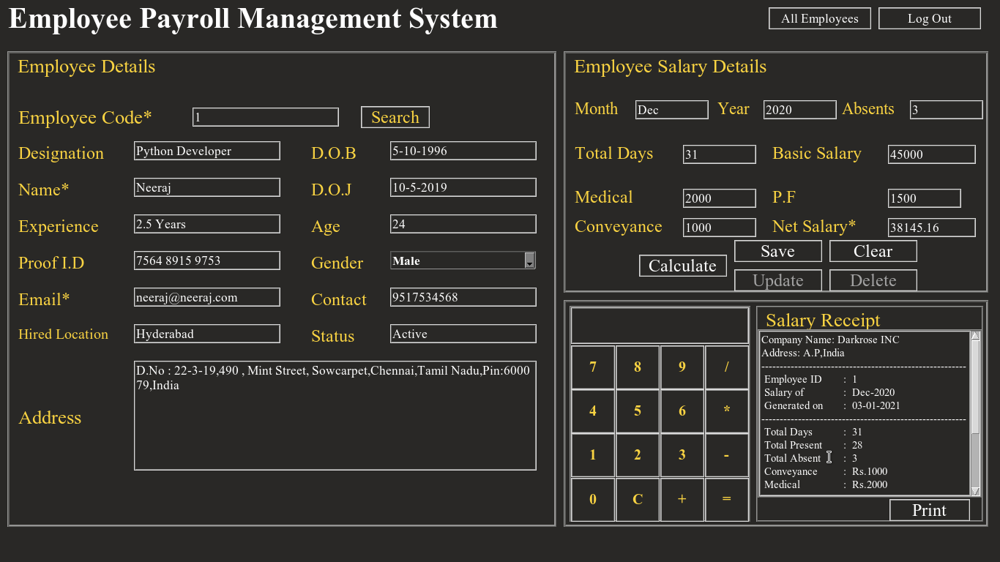
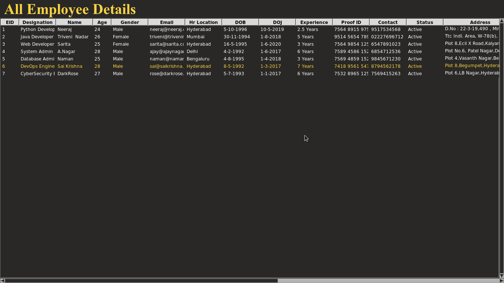

# Employee-Payroll-Mgt

A Simple Python3 based Employee Payroll Management system made using Tkinter Module

Description
============

Employee Payroll Management System is a simple application to store and retrive Employee personal and payroll details.Payslip printing and Calculator functionality were made available in this application.

Features
=========

*Registration & Login functionality available 
*Can store & retrive Employee Personal and Payroll Details(Stored in Mysql Database) 
*Calculator and Pay Slip print functionality available 
*Logout and Forget Password functionality available 
*Update and Delete functionality also available 

Usage
=======

*Install Python3 and Install tkinter,pymysql Modules 
*Install mysql database in System and create username and password 
*Create required databases,tables and data fields for Registration and Employee Payroll Management applications to store and retrive data 
*Change the databases and table names if required in main applications 
*Execute registration.py to register,then login using login form to open main application(epms.py)

